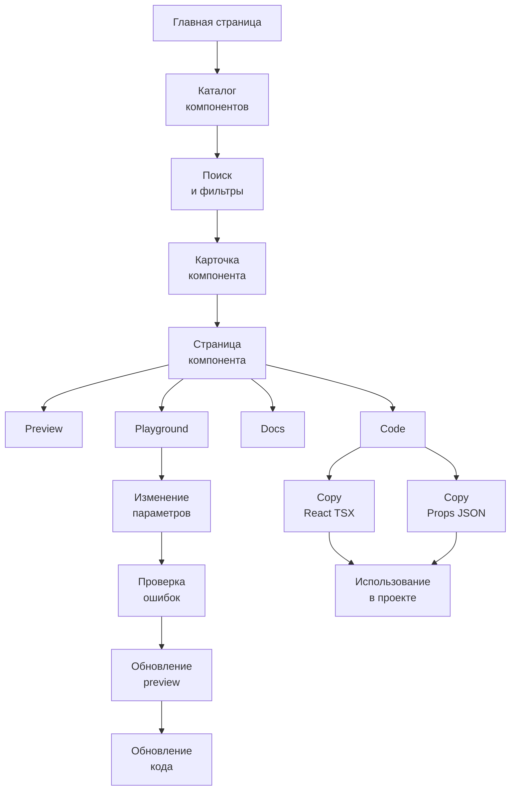
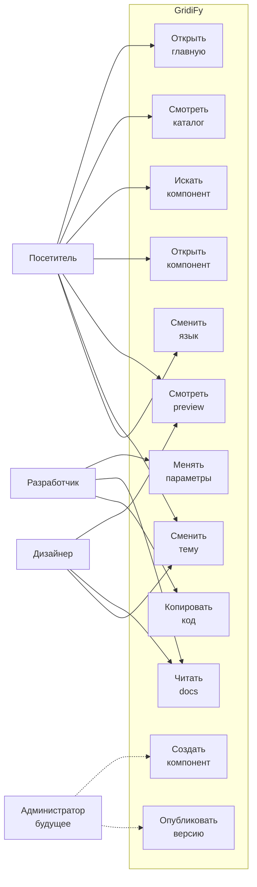
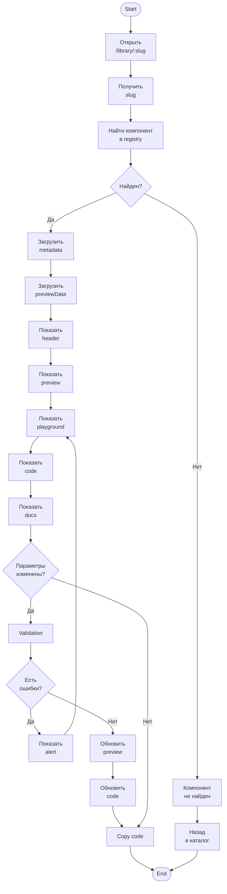
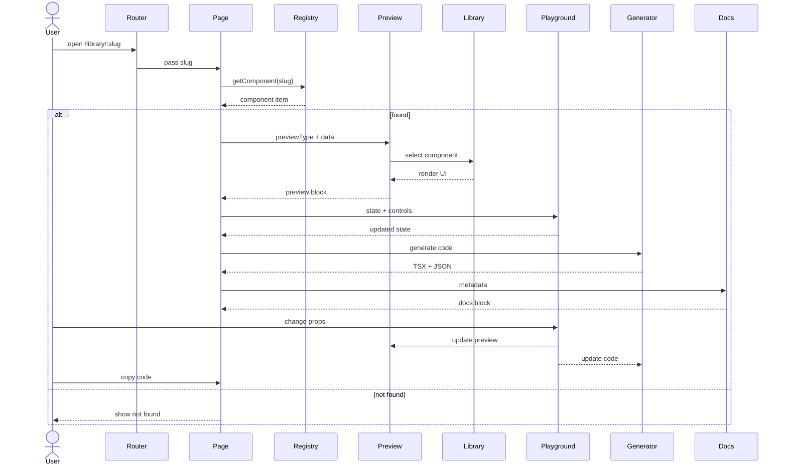
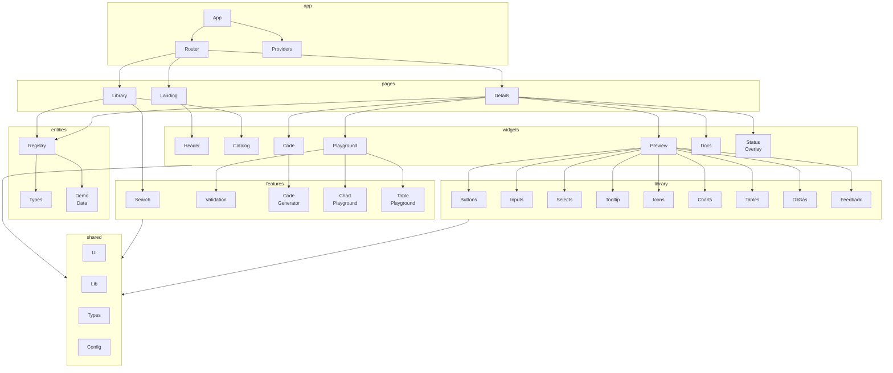
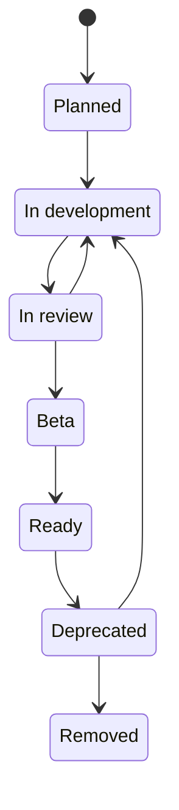
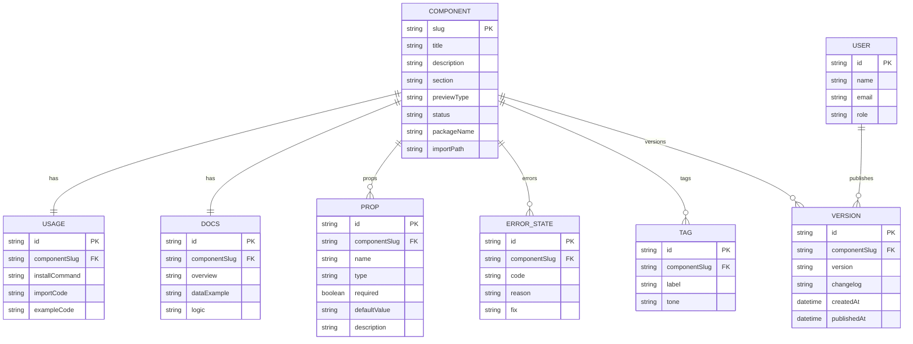
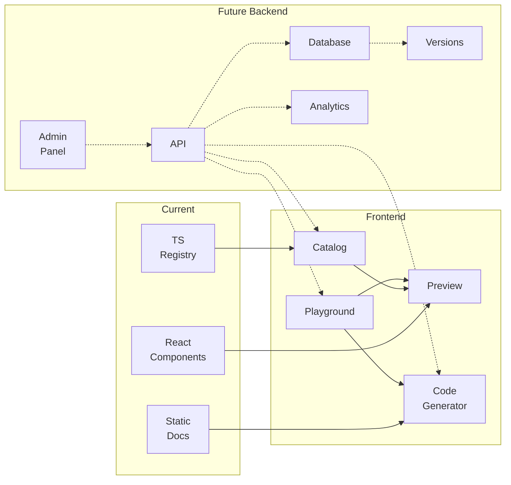

<div align="center">

# ◆ GridiFy

### UI-библиотека и документационная платформа для бизнес-интерфейсов

**GridiFy** — frontend-only платформа компонентов для корпоративных, аналитических, финансовых и отраслевых веб-сервисов.
Проект объединяет каталог UI-компонентов, live-preview, playground, генерацию кода, документацию, дизайн-токены и подготовленную архитектуру для дальнейшего масштабирования.

<br />

[](https://react.dev/)
[](https://www.typescriptlang.org/)
[](https://vite.dev/)
[](https://www.chartjs.org/)

</div>

---

## Содержание

* [О проекте](#о-проекте)
* [Для кого предназначен GridiFy](#для-кого-предназначен-gridify)
* [Бизнес-ценность](#бизнес-ценность)
* [Возможности первой версии](#возможности-первой-версии)
* [Компоненты](#компоненты)
* [Архитектура](#архитектура)
* [Дизайн-система](#дизайн-система)
* [Установка и запуск](#установка-и-запуск)
* [Структура проекта](#структура-проекта)
* [Сценарий использования и архитектурные схемы](#Сценарий-использования-и-архитектурные-схемы)
* [Документация и схемы](#документация-и-схемы)
* [Проблемы и решения](#проблемы-и-решения)
* [Дальнейшее развитие](#дальнейшее-развитие)
* [Команда и контакты](#команда-и-контакты)

---

## О проекте

**GridiFy** — это демонстрационная и инженерная основа UI-библиотеки для бизнес-приложений.

Проект решает задачу систематизации интерфейсных компонентов: вместо разрозненных кнопок, таблиц, графиков и форм GridiFy предоставляет единый каталог с описанием, live-preview, изменяемыми параметрами и автоматически генерируемым примером кода.

На текущем этапе GridiFy реализован как **frontend-only приложение**. Это означает, что проект не требует backend, базы данных, авторизации или отдельной серверной инфраструктуры. Все компоненты, данные для демонстрации и документация хранятся в коде приложения.

Ключевая инженерная идея проекта:

```txt
Components as code.
Registry as metadata.
Preview as resolver.
Docs as structured content.
```

На русском:

```txt
Компоненты хранятся как код.
Каталог хранится как metadata.
Preview строится через resolver.
Документация хранится структурированно.
```

Такой подход позволяет быстро развивать первую версию библиотеки и при этом сохранить возможность дальнейшего перехода к backend registry, базе данных, админке, версионированию и публикации пакета.

---

## Для кого предназначен GridiFy

GridiFy рассчитан на команды, которые создают интерфейсы для бизнес-систем:

| Аудитория                           | Польза                                                                                           |
| ----------------------------------- | ------------------------------------------------------------------------------------------------ |
| Frontend-разработчики               | Быстро берут готовые компоненты, видят props, примеры кода и ошибки использования                |
| UI/UX-дизайнеры                     | Проверяют состояния компонентов, визуальную консистентность и поведение при изменении параметров |
| Бизнес-аналитики                    | Видят, какие интерфейсные блоки уже доступны для проектирования бизнес-сценариев                 |
| Команды корпоративной разработки    | Сокращают повторную разработку типовых элементов интерфейса                                      |
| Продуктовые команды                 | Быстрее собирают прототипы, MVP и внутренние панели управления                                   |
| Образовательные и дипломные проекты | Получают пример инженерно оформленной frontend-платформы компонентов                             |

---

## Бизнес-ценность

GridiFy ориентирован не только на визуальную демонстрацию UI-компонентов, но и на снижение повторной работы в командах разработки.

Проблема, которую решает библиотека:

* одни и те же кнопки, поля, таблицы и графики повторно реализуются в разных проектах;
* документация компонентов часто отсутствует или устаревает;
* разработчики тратят время на подбор состояний, цветов, отступов и вариантов отображения;
* дизайнерские решения сложно переносить в код без расхождений;
* компоненты развиваются хаотично и не имеют единого жизненного цикла.

### Оценочная модель экономии

GridiFy не заявляет гарантированную экономию, но позволяет оценить потенциальный эффект через повторяемые UI-задачи.

Пример расчёта:

```txt
Экономия времени в месяц =
Количество разработчиков × Часы в месяц × Доля UI-задач × Ожидаемое снижение повторной работы
```

Пример для небольшой команды:

| Показатель                                  |        Значение |
| ------------------------------------------- | --------------: |
| Frontend-разработчики                       |               3 |
| Рабочие часы на человека в месяц            |             160 |
| Доля задач, связанных с UI                  |             30% |
| Консервативное снижение повторной UI-работы |             20% |
| Потенциальная экономия                      | 28,8 часа/месяц |

Формула:

```txt
3 × 160 × 0.30 × 0.20 = 28.8 часа/месяц
```

Эта модель показывает не прибыль напрямую, а высвобождение времени команды за счёт переиспользования компонентов, документации и единого набора правил.

---

## Возможности первой версии

В первой версии GridiFy реализованы:

* каталог компонентов;
* live-preview компонентов;
* playground для изменения параметров;
* генерация React TSX-кода;
* генерация Props JSON;
* копирование кода по клику;
* документация компонентов;
* статусы жизненного цикла компонентов;
* цветные теги и группировка;
* поддержка трёх языков: RU / EN / DE;
* светлая и тёмная тема;
* адаптивное отображение;
* компонентные страницы в стиле документации UI-библиотек;
* графики и диаграммы на основе Chart.js и SVG;
* табличные компоненты с формулами;
* отраслевой Oil & Gas компонент;
* frontend-only архитектура без backend.

---

## Компоненты

### Базовые компоненты

| Компонент             | Назначение                                                             |
| --------------------- | ---------------------------------------------------------------------- |
| Buttons               | Базовые кнопки с вариантами, размерами и состояниями                   |
| GridiFy Action Button | Расширенная кнопка с опциональным brand-prefix                         |
| Input Field           | Поля ввода с состояниями default, focus, filled, disabled, error       |
| Select Field          | Single, searchable и multiple select с options и validation            |
| Tooltip               | Всплывающие подсказки с light/dark темой и разными placement           |
| Icon Set              | Набор SVG-иконок для статусов, действий и интерфейсных элементов       |
| Feedback States       | Компонент отображения статусов: info, warning, error, success, neutral |

### Таблицы

| Компонент                | Назначение                                                                 |
| ------------------------ | -------------------------------------------------------------------------- |
| Spreadsheet Table        | Таблица с координатами, редактированием, формулами и выделением диапазонов |
| Financial Planning Table | Таблица для финансового планирования и демонстрации расчётных сценариев    |

### Графики и диаграммы

| Компонент         | Назначение                                                       |
| ----------------- | ---------------------------------------------------------------- |
| Grouped Bar Chart | Сравнение нескольких сущностей по категориям                     |
| Line Chart        | Отображение динамики и трендов                                   |
| Forecast Chart    | Сравнение фактических и прогнозных значений                      |
| Radar Chart       | Сравнение нескольких продуктов или сущностей по набору критериев |
| Scatter Plot      | Точечная диаграмма для анализа распределения                     |
| Pie / Donut Chart | Долевое распределение значений                                   |
| Candlestick Chart | Свечная диаграмма для OHLC-данных                                |

### Отраслевые компоненты

| Компонент                 | Назначение                                                       |
| ------------------------- | ---------------------------------------------------------------- |
| Oil & Gas Inspection Form | Форма инспекции скважины с параметрами, checklist и risk summary |

---

## Архитектура

GridiFy построен как frontend-only component platform.

```txt
src/
  app/          # запуск приложения, router, providers, глобальные стили
  pages/        # страницы: landing, library, component details
  widgets/      # крупные UI-блоки страниц
  features/     # пользовательские сценарии: playground, search, code generation
  entities/     # registry компонентов, metadata, типы и demo data
  library/      # реальные UI-компоненты библиотеки
  shared/       # общие утилиты, типы, UI-примитивы и config
```

### Принцип разделения

| Слой       | Ответственность                                                      |
| ---------- | -------------------------------------------------------------------- |
| `app`      | Подключение провайдеров, маршрутизация, глобальная конфигурация      |
| `pages`    | Сборка страниц из widgets/features/entities                          |
| `widgets`  | Крупные блоки интерфейса: preview, docs, code block, catalog         |
| `features` | Логика действий пользователя: playground, генерация кода, validation |
| `entities` | Модель компонента, registry, demo data                               |
| `library`  | Реальные React-компоненты                                            |
| `shared`   | Переиспользуемые утилиты, типы, маленькие UI-блоки                   |

---

## Дизайн-система

GridiFy строится на собственной системе дизайн-токенов.

В основу заложены:

* семантическая цветовая система;
* светлая и тёмная тема;
* Open Sans как основной шрифт;
* модульная сетка 8px;
* типографические роли;
* радиусы;
* тени;
* состояния focus, error, success;
* utility-классы для фонов, текста, границ и поверхностей.

### Цветовые роли

```txt
Default
Primary
Secondary
Info
Success
Warning
Error
```

Каждая роль имеет набор оттенков от `dark-2` до `light-4`.

### Типографика

```txt
font-family: Open Sans
base font size: 14px
spacing unit: 8px
heading scale: 18px / 20px / 24px / 32px
```

### Радиусы

```txt
none: 0px
sm: 2px
md: 4px
lg: 8px
xl: 16px
2xl: 24px
full: 999px
```

### Тени

```txt
shadow-sm
shadow-md
shadow-lg
shadow-xl
shadow-2xl
shadow-focus
shadow-error
shadow-success
```

Эта система позволяет делать интерфейс визуально консистентным: кнопки, поля, таблицы, подсказки, карточки, теги и графики используют общие правила цвета, отступов и состояний.

---

## Установка и запуск

### Требования

Перед запуском должны быть установлены:

```txt
Node.js
npm
Git
```

Рекомендуется использовать актуальную LTS-версию Node.js.

### Клонирование проекта

```bash
git clone https://github.com/4Raus/GridiFy.git
cd GridiFy/ui-library-front
```

### Установка зависимостей

```bash
npm install
```

### Запуск в режиме разработки

```bash
npm run dev
```

После запуска Vite покажет локальный адрес, обычно:

```txt
http://localhost:5173
```

### Проверка TypeScript

```bash
npm run typecheck
```

### Сборка проекта

```bash
npm run build
```

### Предпросмотр production-сборки

```bash
npm run preview
```

---

## Структура проекта

```txt
GridiFy/
  ui-library-front/
    public/
    src/
      app/
      entities/
      features/
      library/
      pages/
      shared/
      widgets/
    index.html
    package.json
    package-lock.json
    vite.config.ts
    tsconfig.json
    eslint.config.js
```

### Основные файлы

| Файл / папка                                               | Назначение                       |
| ---------------------------------------------------------- | -------------------------------- |
| `src/entities/component/model/componentRegistry.ts`        | Registry компонентов             |
| `src/widgets/component-preview/ComponentPreview.tsx`       | Resolver preview-компонентов     |
| `src/widgets/component-docs/ComponentDocs.tsx`             | Документация компонента          |
| `src/widgets/component-playground/ComponentPlayground.tsx` | Панель изменения параметров      |
| `src/widgets/code-preview/CodePreview.tsx`                 | Блок live-кода                   |
| `src/features/code-generator/`                             | Генерация React TSX и Props JSON |
| `src/library/`                                             | Реальные компоненты библиотеки   |

---

## Сценарий использования и архитектурные схемы

В этом разделе показаны основные схемы работы GridiFy: путь пользователя, сценарии использования, архитектура проекта, последовательность открытия компонента, жизненный цикл компонента и логическая модель каталога.

Диаграммы написаны в формате Mermaid, поэтому они отображаются прямо в GitHub README.

---

### User Way

Диаграмма показывает общий путь пользователя: от входа на сайт до выбора компонента, настройки параметров и копирования кода.



---

### Use Case

Диаграмма показывает основные сценарии использования GridiFy для разных типов пользователей.



---

### Activity Diagram

Диаграмма показывает процесс открытия страницы компонента.



---

### Sequence Diagram

Диаграмма показывает, как страница компонента получает данные, строит preview и обновляет код при изменении параметров.



---

### Component Architecture

Диаграмма показывает целевую архитектуру проекта и разделение ответственности между слоями.



---

### State Machine

Диаграмма показывает жизненный цикл компонента в каталоге.



Статусы используются для отображения готовности компонента в каталоге:

| Статус           | Значение                                    |
| ---------------- | ------------------------------------------- |
| `ready`          | Компонент готов к использованию             |
| `beta`           | Компонент доступен, но API может уточняться |
| `in-development` | Компонент находится в разработке            |
| `review`         | Компонент проходит проверку                 |
| `planned`        | Компонент запланирован                      |
| `deprecated`     | Компонент устаревает                        |

---

### ERD

Так как первая версия GridiFy реализована без backend и базы данных, ERD показывает логическую модель каталога. Сейчас эта модель хранится в TypeScript registry, но в будущем может быть перенесена в backend и БД.



---

### Future Backend Flow

Диаграмма показывает возможное развитие проекта: переход от статического TypeScript registry к backend registry, базе данных, админке и аналитике.




---

## Документация и схемы

Рекомендуемая структура документации:

```txt
docs/
  architecture/
    component-architecture.puml
    user-way.puml
    use-case.puml
    sequence.puml
    activity.puml
    state-machine.puml
    erd.puml
  decisions/
    frontend-only.md
    registry-as-metadata.md
    future-backend.md
  screenshots/
    landing.png
    catalog.png
    component-page.png
```

### Что стоит добавить в будущем

| Документ                  | Назначение                                                        |
| ------------------------- | ----------------------------------------------------------------- |
| `frontend-only.md`        | Почему первая версия реализована без backend                      |
| `registry-as-metadata.md` | Почему компоненты хранятся как код, а registry как metadata       |
| `future-backend.md`       | Как будет устроено масштабирование                                |
| `component-lifecycle.md`  | Статусы компонентов: ready, beta, review, in-development, planned |

---

## Проблемы и решения

### 1. `npm install` падает

Решение:

```bash
rm -rf node_modules package-lock.json
npm install
```

Если `package-lock.json` нужен для фиксации версий, после успешной установки его можно оставить и закоммитить.

### 2. `npm run build` падает из-за `node_modules`

Иногда после переноса архива или работы на другой системе могут ломаться native/optional зависимости.

Решение:

```bash
rm -rf node_modules
npm install
npm run build
```

### 3. `vite: Permission denied` или `eslint: Permission denied`

Часто возникает после переноса проекта архивом между системами.

Решение для Linux/macOS:

```bash
chmod +x node_modules/.bin/vite
chmod +x node_modules/.bin/eslint
```

Или полностью переустановить зависимости:

```bash
rm -rf node_modules
npm install
```

### 4. Порт Vite занят

Запустить на другом порту:

```bash
npm run dev -- --port 5174
```

### 5. TypeScript-ошибки после изменения registry

Проверить:

```bash
npm run typecheck
```

Чаще всего ошибка связана с тем, что для нового компонента не заполнены:

```txt
title
description
previewType
usage
docs
previewData
```

---

## Дальнейшее развитие

GridiFy первой версии — это frontend-only библиотека и документационная платформа.

Дальнейшее развитие предполагает переход к полноценной component platform.

### Этап 1. Текущая версия

```txt
Frontend-only
Static TypeScript registry
React components as code
Live preview
Playground
Docs
Code generation
```

### Этап 2. Пакетная поставка

```txt
npm package
export public components
semantic versioning
changelog
storybook-like examples
```

### Этап 3. Backend registry

В будущем registry можно вынести в backend.

Предполагаемая backend-структура:

```txt
API
  GET /components
  GET /components/:slug
  POST /admin/components
  PATCH /admin/components/:id
  POST /admin/components/:id/publish

Database
  components
  component_versions
  component_docs
  component_props
  component_examples
  users
  roles
```

Backend не должен хранить исполняемый TSX-код как основной источник компонента. Реальные компоненты должны оставаться в npm-пакете или репозитории, а backend должен хранить metadata:

```txt
slug
title
description
status
version
tags
props
docs
examples
preview data
changelog
```

### Этап 4. Админка и роли

```txt
Admin
Maintainer
Designer
Developer
Viewer
```

Возможности:

* создание карточки компонента;
* редактирование документации;
* изменение статуса;
* добавление props;
* публикация новой версии;
* просмотр истории изменений.

### Этап 5. Аналитика использования

```txt
component views
copy code events
popular components
deprecated component usage
search queries
```

Эта аналитика позволит понимать, какие компоненты действительно используются, какие требуют доработки и какие стоит развивать в первую очередь.

---

## Roadmap

| Этап                  | Статус  | Описание                             |
| --------------------- | ------- | ------------------------------------ |
| Каталог компонентов   | Done    | Реализован каталог с карточками      |
| Component preview     | Done    | Реализовано интерактивное preview    |
| Playground            | Done    | Параметры компонентов можно менять   |
| Code generation       | Done    | Генерация React TSX и Props JSON     |
| RU / EN / DE          | Done    | Добавлена локализация                |
| Design tokens         | Done    | Цвета, типографика, радиусы, тени    |
| Таблицы с формулами   | Beta    | Реализованы формулы и редактирование |
| Отраслевые компоненты | Review  | Добавлен Oil & Gas сценарий          |
| npm package           | Planned | Подготовка публичного пакета         |
| Backend registry      | Planned | API, DB, админка, версии             |
| Analytics             | Planned | Метрики использования компонентов    |

---

## Figma

Дизайн и визуальные референсы проекта:

```txt
Figma: https://www.figma.com/design/4cHJUxz5OpwfRlk2AJGepN/Diplome
```

---

## Команда и контакты

GridiFy разрабатывается как учебный, исследовательский и инженерный проект, направленный на создание масштабируемой UI-библиотеки для бизнес-интерфейсов.

### Контакты

```txt
Authors / Team: Александра и Анастасия
Telegram: @whatdouwantm и @barllley
GitHub: https://github.com/4Raus и https://github.com/barllley
```

### Для связи

Если вы хотите предложить улучшение, сообщить об ошибке или обсудить развитие проекта, используйте:

```txt
GitHub Issues: https://github.com/4Raus/GridiFy/issues
```

---

## Лицензия

```txt
All rights reserved until the public package release.
```

---

<div align="center">

**GridiFy**
Reusable UI components for business interfaces.

</div>
